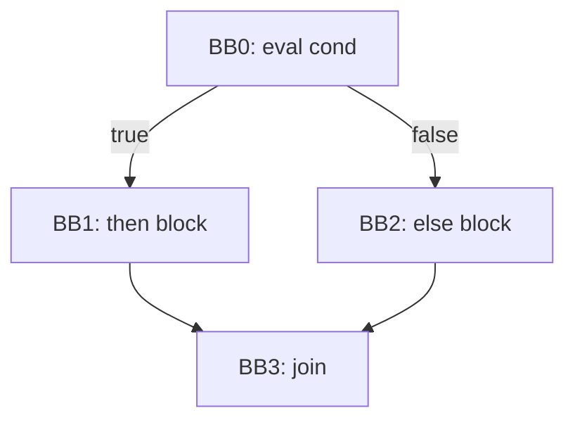
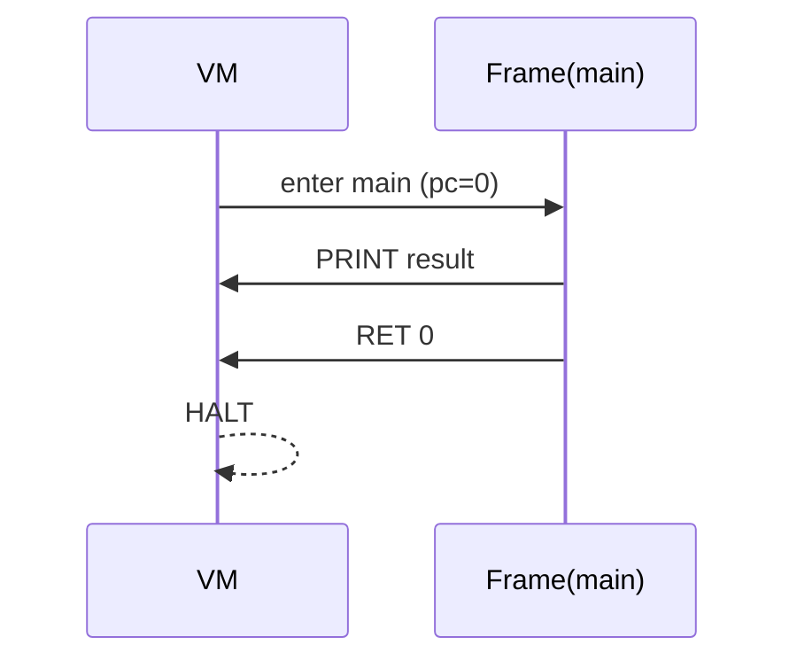

# Assignment 3 Option 1 Implementation Plan for This Codebase

## Executive summary

Your current repo (as published) parses CPM programs into an AST (`Node`) and prints/exports the parse tree (`tree.dot`). The fastest path to Assignment 3 Option 1 is:

1. **Add an IR layer**: generate **linear TAC (three-address code)** per function/method plus explicit `LABEL`, `JMP`, `CJMP`, `RET` terminators.
2. **Build basic blocks + CFG** from that linear TAC using a standard “leaders + terminators” split, then emit **Graphviz DOT** per function (write to files so stdout remains clean).
3. **Emit stack-based bytecode** from the TAC for **just the features used in `test1.cpm`** (numeric expressions, local vars, print, return).
4. **Implement a small interpreter (VM)** that executes that bytecode and produces the correct runtime output for `test1.cpm`.

The minimum you asked to hit is:  
- IR/TAC + CFG for **all programs** (i.e., for any parsed AST; doesn’t require full semantic/type checking to start).  
- Bytecode + interpreter that **runs `test_files/valid/test1.cpm`** (which is a single block with a float expression, `print`, and `return`). fileciteturn27file4L1-L4

---

## Repo analysis and extension points

### What’s in the repo right now

- **Entry point**: `getting_started/main.cc` only runs the parser, then prints and exports the AST via `root->print_tree()` and `root->generate_tree()` when parsing succeeds. fileciteturn3file0L46-L70  
- **AST representation**: `getting_started/Node.h` defines `Node` with `type`, `value`, and `children` as a `std::list<Node*>`. It already has AST printing and DOT generation for the parse tree. fileciteturn17file0L14-L45  
- **Grammar + AST node shapes**: `getting_started/parser.yy` builds a uniform AST where node “kinds” are strings like `Program`, `StmtBlock`, `VarDecl`, `AddExpr`, `CallExpr`, etc. It also shows how a “block-only program” is wrapped into `Program -> Globals, Classes, Entry`. fileciteturn16file2L95-L113  
- **Lexer**: `getting_started/lexer.flex` defines tokens and keywords including `print`, `read`, and `:=`. fileciteturn17file3L16-L60  
- **Build**: `getting_started/Makefile` links only `parser.tab.o`, `lex.yy.c`, and `main.cc`. You must add new `.cc` files here to ship IR/CFG/VM. fileciteturn2file0L1-L8  
- **Minimum interpreter target program**: `getting_started/test_files/valid/test1.cpm` is:
  - one `volatile result : float := (...)`
  - `print(result)`
  - `return 0` fileciteturn27file4L1-L4

### Verifying Assignment 2 artifacts in this repo

You asked to verify presence of `SemanticAnalyzer.cc` and `SymbolTableBuilder.cc`. A repository-wide search for those identifiers returned no hits (i.e., they are not committed under these names in this public repo snapshot). In addition, `main.cc` currently has no calls to semantic passes—only parsing + AST output. fileciteturn3file0L46-L70  
Practical implication: **treat Assignment 3 as wiring new passes into `main.cc` and updating the Makefile**, regardless of the local, unpushed Assignment 2 work you already have.

### Likely extension points (concrete file locations)

You can implement Assignment 3 cleanly by adding the following new modules under `getting_started/`:

- `IR.h` / `IR.cc` — TAC data structures + builder from AST
- `CFG.h` / `CFG.cc` — leader splitting + successor edge construction
- `DotCFGPrinter.h` / `DotCFGPrinter.cc` — DOT emission per function
- `Bytecode.h` / `Bytecode.cc` — bytecode instruction definitions + program container
- `BytecodeEmitter.h` / `BytecodeEmitter.cc` — TAC → bytecode (two-pass for labels)
- `VM.h` / `VM.cc` — interpreter

Also add a tiny AST utility:
- `AstUtil.h` — helpers to access the Nth child in a `std::list<Node*>` (or update `Node.h` to vectors if you prefer).

---

## IR/TAC + basic blocks + CFG + DOT output design

### Minimal TAC representation that fits your AST

A good minimum is “linear TAC + labels + terminators”, then derive BB/CFG. This matches classic compiler practice for flow graphs: cut basic blocks at jump boundaries and jump targets. citeturn1search3turn1search37

**Core idea**: Generate a list of `IRInstr` per function:

- **Non-terminators** (straight-line):
  - `t = CONST_INT k`, `t = CONST_FLOAT f`, `t = CONST_BOOL b`
  - `t = BINOP op a b` (add/sub/mul/div/pow, comparisons)
  - `t = UNOP op a`
  - `t = LOAD_LOCAL slot`
  - `STORE_LOCAL slot, v`
  - `PRINT v`
- **Terminators**:
  - `JMP L`
  - `CJMP v, Ltrue, Lfalse` (or `IFZ v, Lelse`)
  - `RET v`

You can extend later with heap/object instructions for full language coverage (arrays/fields/calls), but CFG construction only needs:
- **labels**
- **jumps**
- **conditional jumps**
- **return** as “no successors”

LLVM’s documentation emphasizes the same invariant you should enforce: a basic block is sequential instructions ending in a terminator. citeturn0search1turn0search7

### What counts as a “function” in your language

From the grammar, you have:
- `Entry` (`main`) with a `StmtBlock` body. fileciteturn16file2L95-L113
- `MethodDecl` nodes inside each class body.  
You should produce one IR function per:
- `main`
- each method: name it `ClassName.methodName` (string concatenation is fine).

`test1.cpm` parses via the “block program” alternative, where the parser creates an `Entry` node with return type `int` and the provided `StmtBlock`. fileciteturn16file2L103-L112

### Basic block construction from TAC (leader algorithm)

Use the standard splitting rule described in classic notes: a basic block is a maximal sequence with one entry and only possible branch at the end; flow graph edges connect possible transfers. citeturn1search3

Implement:

1. **Identify leaders**:
   - First instruction is a leader.
   - Any `LABEL` is a leader.
   - Any instruction immediately following `JMP`, `CJMP`, or `RET` is a leader.
2. **Partition** instruction list into blocks between leaders.
3. **Build edges** (successors):
   - If last is `JMP L`: successor is block starting at `LABEL L`.
   - If last is `CJMP v, Lt, Lf`: successors are both target blocks.
   - If last is `RET`: no successors.
   - Else: fallthrough successor is the next block in linear order.

This definition aligns with LLVM’s “terminator at end” invariant citeturn0search1 and widely used CFG definitions. citeturn1search0turn1search1

### DOT output for CFG

Emit one DOT file per function, e.g.:
- `cfg_main.dot`
- `cfg_Fibonacci.fib.dot`

Graphviz DOT string escaping matters. DOT supports quoted strings; embedded newlines and quoting rules are documented by Graphviz. citeturn0search0  
Recommendation: Node labels use a monospaced font and `\l` line breaks:

- `label="BB0:\l t0 = CONST_INT 2\l ...\l"`

### Mapping AST → TAC (minimum to cover all constructs, even if VM only runs `test1`)

From your grammar:

- Program shape and “statement-only program” wrapper: fileciteturn16file2L95-L113
- Statement forms including `VarStmt`, `AssignStmt`, `IfStmt`, `IfElseStmt`, `ForStmt`, `PrintStmt`, `ReadStmt`, `ReturnStmt`: fileciteturn16file2L277-L299
- Postfix forms including indexing/length/field/call: fileciteturn16file2L403-L431

Implement TAC generation for control flow:
- `IfStmt(cond, body)` → labels + `CJMP`
- `IfElseStmt(cond, then, else)` → labels + `CJMP` + `JMP`
- `ForStmt(init, cond, update, body)` → canonical loop with `Lcond`, `Lbody`, `Lend`, plus a loop-context stack to lower `break`/`continue`.

Even if the VM doesn’t execute all of these yet, you still produce TAC and CFG for them.

#### Mermaid CFG shape (if/else)



---

## Bytecode design for Option 1

### Stack-based VM rationale

A stack machine is a natural fit: push operands, apply opcodes, store results. Stanford’s lecture notes explicitly contrast stack machines vs three-address code machines at a conceptual level. citeturn1search3

For calls and frames, you can keep the design minimal now but compatible with future methods. Crafting Interpreters gives a clean, practical calling convention for a bytecode VM with call frames. citeturn0search2

### Minimal instruction set (enough for `test1.cpm`, plus control-flow scaffolding)

You can implement a small superset now; only a subset must work for `test1`.

| Opcode | Operands | Stack effect | Meaning |
|---|---:|---|---|
| `PUSH_I` | int32 | `… → …, v` | push integer constant |
| `PUSH_F` | float64 | `… → …, v` | push float constant |
| `LOAD` | slot | `… → …, v` | push value from frame slot |
| `STORE` | slot | `…, v → …` | pop value into frame slot |
| `ADD/SUB/MUL/DIV/POW` | — | `…, a, b → …, r` | numeric ops with promotion |
| `PRINT` | — | `…, v → …` | print and pop |
| `JMP` | addr | `… → …` | unconditional branch |
| `JMP_F` | addr | `…, v → …` | pop v; jump if false |
| `RET` | — | `…, v → …` | return from function with value |
| `HALT` | — | `… → …` | stop VM (optional) |

**Data model**: `Value = Int | Float | Bool | Ref(Object) | Ref(Array) | Nil`.  
For `test1`, only `Int` and `Float` are required.

### Calling convention (design now, even if `test1` uses only `main`)

For future methods:
- `CALL funcId argc`: expects arguments pushed in order; creates new `Frame` and assigns params from popped values (simple copy is fine).
- `RET`: returns a value to the caller by pushing it on the caller stack.

Crafting Interpreters notes a more optimized convention where callee parameters overlap caller argument slots to avoid copying; you can skip this optimization initially and still keep the conceptual model. citeturn0search2

#### Mermaid call stack flow



### Bytecode representation in memory/on disk

**In-memory (recommended first)**:
- `struct Instr { Op op; int32_t a; double f; }` (store only fields relevant to op)
- `struct FunctionBC { string name; int nSlots; vector<Instr> code; }`
- `struct ProgramBC { vector<FunctionBC> funcs; int entryFunc; }`

**Optional on-disk (later)**:
- Header: magic `CPMB`, version
- Function table: name, slotCount, codeSize
- Code blob: serialized `Instr`

Disk format is likely not required for the minimum you stated; keep it as a stretch goal.

---

## Bytecode emitter from your TAC

### Key simplifying choice: store TAC temporaries in slots

Because TAC is in three-address form, emitting direct stack code without temps requires expression re-scheduling. The simplest emitter is:

- Allocate:
  - `0..(nLocals-1)` for variables
  - `nLocals..(nLocals+nTemps-1)` for TAC temporaries `t0..tN`
- Each TAC `t = OP a b` becomes:
  - emit code to **push** `a`, push `b`, apply opcode, `STORE tSlot`

This is not optimal but extremely reliable—perfect for minimums.

### IR → bytecode mapping table (core subset)

| TAC | Bytecode sequence |
|---|---|
| `t = CONST_INT k` | `PUSH_I k; STORE t` |
| `t = CONST_FLOAT f` | `PUSH_F f; STORE t` |
| `t = BINOP + a b` | `load(a); load(b); ADD; STORE t` |
| `STORE_LOCAL x, v` | `load(v); STORE x` |
| `PRINT v` | `load(v); PRINT` |
| `RET v` | `load(v); RET` |
| `LABEL L` | no instruction; record `L → pc` |
| `JMP L` | `JMP addr(L)` (patch later) |
| `CJMP v, Lt, Lf` | `load(v); JMP_F addr(Lf); JMP addr(Lt)` (or inverted) |

### Control flow patching

Implement a two-pass or patch-list approach:

1. **First pass**: emit bytecode; record each label’s `pc`; for jumps whose label not known yet, store `(instrIndex, labelId)` in a fixup list.
2. **Second pass**: fill in jump targets.

This matches the common approach when lowering named labels to numeric addresses.

---

## Interpreter implementation plan

### Runtime data structures

Minimum for `test1`:
- `vector<Value> stack;`
- `Frame { int funcId; size_t pc; vector<Value> slots; }`
- `vector<Frame> callStack;` (only one frame for `test1`)

`slots` must hold locals + temps.

### Dispatch loop (core)

Pseudo-logic:
- Fetch `instr = code[pc++]`
- `switch(instr.op)`:
  - `PUSH_I`: push int
  - `PUSH_F`: push float
  - `LOAD`: push slots[a]
  - `STORE`: slots[a] = pop()
  - `ADD/SUB/MUL/DIV/POW`: pop b, pop a, compute with promotion, push r
  - `PRINT`: pop v; print v with type-based formatting
  - `JMP`: pc = a
  - `JMP_F`: v=pop(); if !truthy(v) pc=a
  - `RET`: v=pop(); return to caller or exit

### Numeric semantics for `test1`

`test1.cpm`’s expression should evaluate to **508.5** under standard precedence and exponentiation:  
- `4*2 = 8`, `2^8 = 256`, `+10 = 266`, `-2*6 = 254`, `+1.0/4.0 = 254.25`, `*2 = 508.5`. fileciteturn27file4L1-L4  
So your VM should print `508.5` (or a compatible float formatting) and return 0.

### I/O (`print`, `read`)

Your lexer defines `print` and `read` tokens explicitly. fileciteturn17file3L59-L60  
For minimums:
- `PRINT`: print numeric/bool
- `READ`: can be unimplemented initially if not needed for `test1`; still generate TAC/CFG for programs that contain it (or implement a best-effort parse into int/float depending on presence of `.`).

### Error handling

Implement VM runtime checks (fail fast with stderr + nonzero exit code):
- stack underflow
- invalid slot index
- invalid opcode
- division by zero (optional for minimum)
- `pow` domain errors (optional)

---

## Testing, validation, and implementation milestones

### Commands you should support

Build:
```bash
make clean && make
```
Run minimum interpreter test:
```bash
./compiler < test_files/valid/test1.cpm
```
Generate CFG PDFs (after you emit DOT):
```bash
dot -Tpdf cfg_main.dot -o cfg_main.pdf
```
DOT language rules for quoted labels and multi-line formatting are documented by Graphviz; follow them when escaping labels. citeturn0search0

### Suggested milestone breakdown (effort as complexity, not time)

| Milestone | Deliverable | Complexity |
|---|---|---|
| Wire new build + entry flags | Makefile links new `.cc`; `main.cc` calls IR/CFG builder | Small |
| TAC data structures + AST → TAC | `IRProgram` with functions; text dump for debugging | Medium |
| Basic blocks + CFG + DOT | Split into BBs; emit `cfg_*.dot` | Medium |
| Bytecode format + emitter | TAC → bytecode; label fixups | Medium |
| VM executes `test1` | prints correct value + exits 0 | Medium |
| Polish | debug toggles, nicer printing, more op coverage | Small–Medium |

### Concrete edits in this repo

1. **Update `getting_started/Makefile`** to compile/link your new modules (it currently links only `parser.tab.o`, `lex.yy.c`, `main.cc`). fileciteturn2file0L1-L8  
2. **Update `getting_started/main.cc`**:
   - keep parsing
   - instead of always printing the AST (`root->print_tree()` / `root->generate_tree()`), run:
     - `buildIR(root)`
     - `buildCFG(ir)`
     - `emitDot(cfg)`
     - `emitBytecode(ir)`
     - `runVM(bytecode)`
   - optionally keep AST printing under a `--ast` flag (otherwise it will pollute program output). Current AST printing is here: fileciteturn3file0L62-L68  
3. **AST child access helper**: because `Node.children` is a `std::list`, you’ll want a helper to fetch child by index. fileciteturn17file0L16-L20  
4. **Ensure you cover all statement node kinds** listed in the grammar when generating TAC/CFG (`IfStmt`, `IfElseStmt`, `ForStmt`, etc.). fileciteturn16file2L277-L299  
5. **Ensure you cover postfix expression shapes** (`IndexExpr`, `LengthExpr`, `FieldExpr`, `CallExpr`) at least in TAC generation so CFG still builds for all programs. fileciteturn16file2L403-L431  

### Example output artifacts you should produce (non-stdout)

- `cfg_main.dot` and `cfg_main.pdf`
- optional `ir_main.txt` (TAC listing)
- optional `bytecode_main.txt` (disassembly)

Keeping these as files avoids interfering with the required runtime output from `print(...)`.

### Example bytecode listing for `test1.cpm`

A plausible disassembly (with temp slots) could look like:

```
# function main, slots: 1 local (result) + N temps
PUSH_I 4
PUSH_I 2
MUL
STORE t0
PUSH_I 2
LOAD  t0
POW
STORE t1
PUSH_I 10
LOAD  t1
ADD
STORE t2
PUSH_I 2
PUSH_I 6
MUL
STORE t3
LOAD  t2
LOAD  t3
SUB
STORE t4
PUSH_F 1.0
PUSH_F 4.0
DIV
STORE t5
LOAD  t4
LOAD  t5
ADD
STORE t6
PUSH_I 2
LOAD  t6
MUL
STORE t7
LOAD  t7
STORE result
LOAD  result
PRINT
PUSH_I 0
RET
```

This matches the structure of `test1.cpm` (one initialized var, one print, one return). fileciteturn27file4L1-L4  

---

### Notes on correctness expectations for CFG

A CFG is typically defined as basic blocks plus directed edges capturing possible transfers of control; blocks with multiple successors end in a selecting action (conditional branch). citeturn1search0turn1search3turn0search1  
Using that definition as your invariant will keep your DOT output and block splitting consistent and easy to explain in a presentation.